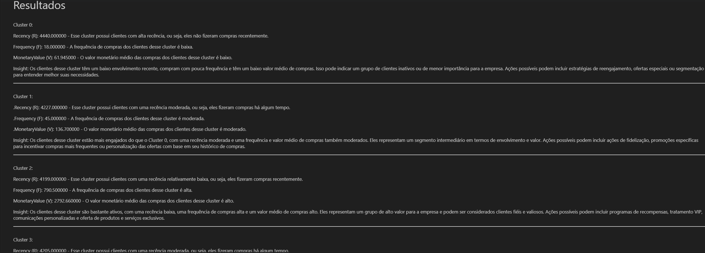

# E-comerce_cluster_RFV
<h3> O objetivo de um algoritimo cluster é dividir e agrupar itens, clientes, objetos etc. com base nas features contidas no dataset </3>
<h3>neste modelo o objetivo é dividir com base nas váriaveis da análise RFM:</3>
</h4> 
R – Recência  
 
F – Frequência 
 
M – Monetaridade 
</h4>

<h4> <a href="[https://twitter.com/docusaurus](https://www.notion.so/signed/https%3A%2F%2Fs3-us-west-2.amazonaws.com%2Fsecure.notion-static.com%2Fe73c934e-cd3a-4e00-85f6-b704762fec77%2Fdata.csv?table=block&id=e9f1a77d-e0db-46c4-8ef0-c79064da3c0e&spaceId=6a055055-52ec-4ebb-a697-63027c951344&userId=c0845f00-59fb-4a0f-bb4a-c1e2314cd202&cache=v2)"> Download banco de dados utilizado </a> </h3>

## RESULTADO:
### Segmentar os clientes e perfis que possam ser estudados separadamentes dentro do negócio

 

  

